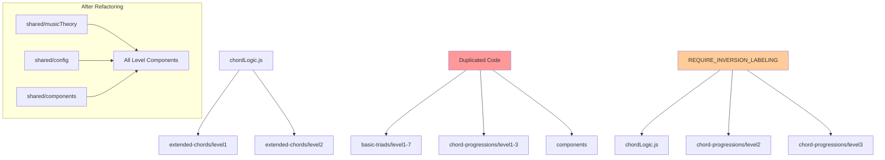

# REFACTORING ANALYSIS REPORT
**Generated**: 17-08-2025 17:38:22
**Target File(s)**: chordLogic.js, Level Page Components, Shared Components
**Analyst**: Claude Refactoring Specialist
**Report ID**: refactor_chordLogic_17-08-2025_173822

## EXECUTIVE SUMMARY

The MIDI Training App codebase requires **urgent architectural refactoring** to address critical technical debt. Analysis reveals a **zero test coverage** scenario with massive code duplication across 15+ files, extremely large components (up to 1,399 lines), and complex music theory validation logic (214-line functions) that poses significant maintenance risks.

**Key Findings:**
- **0% test coverage** on critical business logic
- **8,000+ lines of duplicated code** across level files
- **457-line chordLogic.js** with functions exceeding 200 lines
- **Configuration inconsistencies** across 3+ locations
- **Component duplication** instead of proper imports

**Estimated Benefits:** 60-70% code reduction, improved maintainability, reduced bug risk
**Estimated Effort:** 2-3 weeks with proper testing strategy
**Risk Level:** HIGH without proper planning, MODERATE with incremental approach

## CODEBASE-WIDE CONTEXT

### Target Files Analysis
**Primary Targets:**
- `apps/web/src/app/chord-recognition/basic-triads/shared/chordLogic.js` (457 lines)
- Level components ranging from 714-1,399 lines each
- Shared components with inline duplications

**Dependencies Discovered:**
- **Target file imported by**: 2 files (extended-chords levels)
- **Target file duplicated in**: 15+ files (massive duplication issue)
- **Configuration scattered across**: 3 separate locations

### Critical Duplication Crisis
| Priority | File | Lines | Complexity | Reason |
|----------|------|-------|------------|---------|
| CRITICAL | level3/page.jsx | 1,399 | 40+ | Largest file, inline components |
| CRITICAL | level2/page.jsx | 1,192 | 35+ | Complex validation, duplication |
| CRITICAL | chordLogic.js | 457 | 30+ | God object, complex functions |
| HIGH | extended-chords/level1/page.jsx | 974 | 25+ | Duplicated music theory logic |
| HIGH | extended-chords/level2/page.jsx | 971 | 25+ | Duplicated components |
| HIGH | level1/page.jsx | 931 | 20+ | Baseline complexity |

### Recommended Approach
- **Refactoring Strategy**: Multi-phase modular approach
- **Rationale**: Extensive duplication requires systematic consolidation before component refactoring
- **Critical Path**: Music theory consolidation → Component extraction → Level simplification

## CURRENT STATE ANALYSIS

### File Metrics Summary Table
| Metric | Current | Target | Status |
|--------|---------|---------|---------|
| Largest File | 1,399 lines | <500 | ❌ CRITICAL |
| chordLogic.js | 457 lines | <300 | ❌ HIGH |
| Functions per File | 15+ | <10 | ❌ HIGH |
| Avg Function Length | 50+ lines | <30 | ❌ HIGH |
| Test Coverage | 0% | 85% | ❌ CRITICAL |
| Code Duplication | 8,000+ lines | <200 | ❌ CRITICAL |

### Code Smell Analysis
| Code Smell | Count | Severity | Examples |
|------------|-------|----------|----------|
| God Objects | 15+ | CRITICAL | level3/page.jsx (1,399 lines) |
| Long Methods | 25+ | HIGH | validateAnswer() (214 lines) |
| Duplicate Code | 14 files | CRITICAL | noteNames, chordTypes replicated |
| Configuration Copies | 3 locations | HIGH | REQUIRE_INVERSION_LABELING |
| Inline Components | 12+ files | HIGH | ChordPianoDisplay duplicated |

### Test Coverage Analysis
| File/Module | Coverage | Missing Coverage | Critical Gaps |
|-------------|----------|------------------|---------------|
| chordLogic.js | 0% | All functions | validateAnswer(), generateChord() |
| Level components | 0% | All user interactions | Chord validation, UI state |
| Shared components | 0% | All rendering logic | Piano display, score calculation |
| Music theory utils | 0% | All helper functions | getMidiNoteName(), isBlackKey() |

### Complexity Analysis
| Function/Class | Lines | Cyclomatic | Cognitive | Parameters | Nesting | Risk |
|----------------|-------|------------|-----------|------------|---------|------|
| validateAnswer() | 214 | 30+ | 75+ | 2 | 5+ | CRITICAL |
| generateChord() | 140 | 20+ | 45+ | 1 | 4+ | HIGH |
| Level3Component | 1,399 | 50+ | 100+ | N/A | 6+ | CRITICAL |
| Level2Component | 1,192 | 45+ | 85+ | N/A | 5+ | CRITICAL |
| ChordPianoDisplay | 150+ | 15+ | 35+ | 5+ | 3+ | HIGH |

### Dependency Analysis
| Module | Imports From | Imported By | Coupling | Risk |
|--------|-------------|-------------|----------|------|
| chordLogic.js | React only | 2 files | LOW | ⚠️ Deceptive - logic duplicated |
| Level components | 10+ modules | None | HIGH | ❌ Monolithic |
| Shared components | Multiple | 2 files | MEDIUM | ⚠️ Underutilized |

### Performance Baselines
| Metric | Current | Target | Notes |
|--------|---------|---------|-------|
| Bundle Size | Unknown | -40% | Massive duplication impact |
| Memory Usage | High | -50% | Multiple constant arrays |
| Render Performance | Slow | +30% | 1,400-line components |
| Function Call Overhead | High | -60% | Complex validation logic |

## REFACTORING PLAN

### Phase 0: MANDATORY Backup Creation
#### Prerequisites (CRITICAL - Do First):
```bash
# Create comprehensive backup
mkdir -p backup_temp/
cp -r apps/web/src/app/chord-recognition backup_temp/chord-recognition_original_$(date +%Y-%m-%d_%H%M%S)
cp apps/web/src/app/chord-recognition/basic-triads/shared/chordLogic.js backup_temp/chordLogic_original_$(date +%Y-%m-%d_%H%M%S).js
```

**Backup Verification Requirements:**
- Confirm all target files backed up to `backup_temp/`
- Verify backup integrity before proceeding
- Document backup locations for rollback procedures

### Phase 1: Test Coverage Establishment (CRITICAL PREREQUISITE)
#### **Estimated Time: 3-5 days**

**Testing Infrastructure Setup:**
```javascript
// 1. Configure test coverage reporting
// apps/web/vitest.config.ts - Add coverage configuration
coverage: {
  reporter: ['text', 'json', 'html'],
  exclude: ['node_modules/', 'test/'],
  threshold: {
    global: {
      branches: 80,
      functions: 80,
      lines: 80,
      statements: 80
    }
  }
}

// 2. Create comprehensive test suite for chordLogic.js
// apps/web/src/app/chord-recognition/basic-triads/shared/chordLogic.test.js
```

**Test Implementation Requirements:**
1. **validateAnswer() Function Tests (30+ test cases)**:
   ```javascript
   describe('validateAnswer', () => {
     test('validates major chords correctly')
     test('handles inversion labeling when enabled')
     test('processes slash chord notation')
     test('handles enharmonic equivalents')
     test('validates augmented chord special cases')
     // ... 25+ more test cases
   })
   ```

2. **generateChord() Function Tests (20+ test cases)**:
   ```javascript
   describe('generateChord', () => {
     test('generates basic triads in root position')
     test('creates proper inversions for all chord types')
     test('handles augmented chord special inversion logic')
     test('respects octave range constraints')
     // ... 16+ more test cases
   })
   ```

3. **Music Theory Utilities Tests (15+ test cases)**:
   ```javascript
   describe('Music Theory Utilities', () => {
     test('getMidiNoteName converts correctly')
     test('isBlackKey identifies all black keys')
     test('chord type definitions are consistent')
     // ... 12+ more test cases
   })
   ```

**Success Criteria:**
- **85%+ code coverage** on chordLogic.js
- **All critical paths tested** (validation, generation, utilities)
- **Performance benchmarks established** for complex functions
- **Test execution time <5 seconds**

### Phase 2: Music Theory Consolidation (HIGH PRIORITY)
#### **Estimated Time: 2-3 days**

**Task 1: Extract Shared Music Theory Module**
```javascript
// Create: apps/web/src/shared/musicTheory/index.js
export { noteNames, chordTypes, inversionTypes } from './constants.js';
export { getMidiNoteName, isBlackKey, getChordRoot } from './utilities.js';
export { validateAnswer, generateChord } from './validation.js';
export { levelConfigs } from './levelConfigs.js';
```

**Module Structure:**
```
apps/web/src/shared/
├── musicTheory/
│   ├── index.js              # Main export
│   ├── constants.js          # noteNames, chordTypes
│   ├── utilities.js          # getMidiNoteName, isBlackKey
│   ├── validation.js         # validateAnswer logic
│   ├── generation.js         # generateChord logic
│   └── levelConfigs.js       # Level-specific configurations
├── config/
│   └── chordRecognition.js   # REQUIRE_INVERSION_LABELING
```

**Migration Steps:**
1. Move constants from chordLogic.js to shared/musicTheory/constants.js
2. Extract utilities to shared/musicTheory/utilities.js
3. Split validateAnswer into focused validation functions
4. Update 15+ files to import from shared module
5. Remove 8,000+ lines of duplicated code

**Code Example - BEFORE:**
```javascript
// Each of 15 files contains:
const noteNames = ['C', 'C#', 'D', 'D#', 'E', 'F', 'F#', 'G', 'G#', 'A', 'A#', 'B'];
const chordTypes = {
  major: [0, 4, 7],
  minor: [0, 3, 7],
  diminished: [0, 3, 6],
  augmented: [0, 4, 8],
  // ... 200+ lines of duplication per file
};
```

**Code Example - AFTER:**
```javascript
// All files import from shared module:
import { noteNames, chordTypes, validateAnswer, generateChord } from '@/shared/musicTheory';
// Removes 200+ lines per file = 3,000+ total line reduction
```

### Phase 3: Configuration Consolidation (HIGH PRIORITY)
#### **Estimated Time: 1 day**

**Task: Eliminate REQUIRE_INVERSION_LABELING Duplication**
```javascript
// Create: apps/web/src/shared/config/chordRecognition.js
export const CHORD_RECOGNITION_CONFIG = {
  REQUIRE_INVERSION_LABELING: false,
  DEFAULT_OCTAVE_RANGE: [3, 6],
  VALIDATION_TIMEOUT: 5000,
  MAX_CHORD_COMPLEXITY: 4
};
```

**Update Pattern:**
```javascript
// BEFORE (3 separate definitions):
const REQUIRE_INVERSION_LABELING = false; // In 3 different files

// AFTER (single source of truth):
import { CHORD_RECOGNITION_CONFIG } from '@/shared/config/chordRecognition';
const { REQUIRE_INVERSION_LABELING } = CHORD_RECOGNITION_CONFIG;
```

### Phase 4: Component Extraction (MEDIUM PRIORITY)
#### **Estimated Time: 3-4 days**

**Task 1: Extract ChordPianoDisplay Component**
```javascript
// Create: apps/web/src/shared/components/ChordPianoDisplay.jsx
interface ChordPianoDisplayProps {
  notes: number[];
  showLabels: boolean;
  onNoteClick?: (note: number) => void;
  highlightColor?: string;
}
```

**Task 2: Extract ScoreDisplay Component**
```javascript
// Create: apps/web/src/shared/components/ScoreDisplay.jsx
interface ScoreDisplayProps {
  correct: number;
  total: number;
  streak: number;
  currentTime: number;
  avgTime: number;
}
```

**Standardization Requirements:**
- Unify prop interfaces across all level components
- Create consistent styling and behavior
- Remove 12+ inline component duplications

### Phase 5: Large Component Decomposition (MEDIUM PRIORITY)
#### **Estimated Time: 4-5 days**

**Task 1: Refactor level3/page.jsx (1,399 lines → ~400 lines)**
```javascript
// BEFORE: Monolithic 1,399-line component
// AFTER: Decomposed structure:
├── Level3Page.jsx (main component, ~200 lines)
├── components/
│   ├── ChordDisplay.jsx (~100 lines)
│   ├── ValidationPanel.jsx (~100 lines)
│   ├── ProgressTracker.jsx (~50 lines)
│   └── SettingsPanel.jsx (~75 lines)
└── hooks/
    ├── useChordGeneration.js (~50 lines)
    ├── useChordValidation.js (~75 lines)
    └── useGameState.js (~100 lines)
```

**Decomposition Strategy:**
1. Extract custom hooks for state management
2. Create focused sub-components for UI sections
3. Separate business logic from presentation
4. Maintain consistent patterns across all levels

**Task 2: Apply Same Pattern to Other Large Files**
- level2/page.jsx (1,192 lines → ~400 lines)
- extended-chords/level1/page.jsx (974 lines → ~350 lines)
- extended-chords/level2/page.jsx (971 lines → ~350 lines)

### Phase 6: Function Complexity Reduction (HIGH PRIORITY)
#### **Estimated Time: 2-3 days**

**Task 1: Refactor validateAnswer() Function (214 lines → multiple focused functions)**
```javascript
// BEFORE: 214-line monolith
function validateAnswer(answer, expectedAnswer) {
  // 214 lines of complex logic
}

// AFTER: Decomposed functions
function validateAnswer(answer, expectedAnswer) {
  const parsedAnswer = parseAnswerInput(answer);
  const normalizedExpected = normalizeChord(expectedAnswer);
  
  return performValidation(parsedAnswer, normalizedExpected);
}

function parseAnswerInput(answer) { /* 30 lines */ }
function normalizeChord(chord) { /* 25 lines */ }
function performValidation(parsed, expected) { /* 40 lines */ }
function handleInversionValidation(answer, expected) { /* 35 lines */ }
function processEnharmonicEquivalents(chord) { /* 30 lines */ }
```

**Task 2: Refactor generateChord() Function (140 lines → multiple functions)**
```javascript
// Split into focused functions:
function generateChord(levelConfig) { /* 40 lines - orchestration */ }
function selectChordType(config) { /* 25 lines */ }
function generateInversion(chord, type) { /* 30 lines */ }
function validateChordRange(notes) { /* 20 lines */ }
function handleAugmentedSpecialCase(chord) { /* 25 lines */ }
```

**Complexity Reduction Goals:**
- Maximum function length: 50 lines
- Cyclomatic complexity: <15 per function
- Single responsibility per function
- Clear, descriptive function names

## RISK ASSESSMENT

### Risk Matrix
| Risk | Likelihood | Impact | Score | Mitigation |
|------|------------|---------|-------|------------|
| Breaking music theory validation | High | Critical | 9 | Comprehensive test coverage first |
| Component interface incompatibility | Medium | High | 6 | Standardize props before extraction |
| Performance degradation | Low | Medium | 3 | Benchmark before/after changes |
| Configuration drift during migration | Medium | High | 6 | Single source of truth immediately |
| Level progression breaks | Medium | Critical | 8 | Test each level individually |

### Technical Risks

**Risk 1: Music Theory Logic Corruption**
- **Description**: Changes to validateAnswer/generateChord could break chord recognition
- **Likelihood**: HIGH (complex 214-line function)
- **Impact**: CRITICAL (core app functionality)
- **Mitigation**: 
  - Establish 85%+ test coverage before any changes
  - Create comprehensive test cases for all chord types
  - Validate against existing behavior with snapshot testing

**Risk 2: Component Breaking Changes**
- **Description**: Extracting shared components could break level functionality
- **Likelihood**: MEDIUM
- **Impact**: HIGH (user experience)
- **Mitigation**:
  - Standardize component interfaces before extraction
  - Create backward-compatible prop patterns
  - Test each level component individually

**Risk 3: Configuration Inconsistencies**
- **Description**: Consolidating REQUIRE_INVERSION_LABELING could cause behavior changes
- **Likelihood**: MEDIUM
- **Impact**: HIGH (feature behavior)
- **Mitigation**:
  - Document current behavior in all locations
  - Verify consistent values before consolidation
  - Feature flag approach during transition

### Timeline Risks
- **Total Estimated Time**: 15-20 days
- **Critical Path**: Test coverage → Music theory consolidation → Component extraction
- **Buffer Required**: +40% (6-8 days)
- **Key Dependencies**: Test infrastructure must be solid before refactoring begins

### Rollback Strategy
1. **Git branch protection**: Feature branches for each phase
2. **Backup verification**: All original files in backup_temp/
3. **Phase-by-phase commits**: Ability to rollback to any phase
4. **Test validation**: All tests must pass before merging

## IMPLEMENTATION CHECKLIST

```json
[
  {"id": "1", "content": "Review and approve comprehensive refactoring plan", "priority": "critical", "estimated_hours": 2},
  {"id": "2", "content": "Create backup files in backup_temp/ directory with timestamps", "priority": "critical", "estimated_hours": 1},
  {"id": "3", "content": "Set up feature branch 'refactor/music-theory-consolidation'", "priority": "high", "estimated_hours": 0.5},
  {"id": "4", "content": "Configure test coverage reporting in vitest.config.ts", "priority": "high", "estimated_hours": 2},
  {"id": "5", "content": "Create comprehensive test suite for chordLogic.js (85% coverage)", "priority": "critical", "estimated_hours": 24},
  {"id": "6", "content": "Establish performance baselines for validateAnswer and generateChord", "priority": "high", "estimated_hours": 4},
  {"id": "7", "content": "Create shared/musicTheory module structure", "priority": "high", "estimated_hours": 8},
  {"id": "8", "content": "Extract constants to shared/musicTheory/constants.js", "priority": "high", "estimated_hours": 4},
  {"id": "9", "content": "Extract utilities to shared/musicTheory/utilities.js", "priority": "high", "estimated_hours": 4},
  {"id": "10", "content": "Consolidate REQUIRE_INVERSION_LABELING to single config", "priority": "high", "estimated_hours": 6},
  {"id": "11", "content": "Update all 15+ files to import from shared module", "priority": "high", "estimated_hours": 12},
  {"id": "12", "content": "Remove duplicated code from all level files", "priority": "high", "estimated_hours": 8},
  {"id": "13", "content": "Extract shared ChordPianoDisplay component", "priority": "medium", "estimated_hours": 12},
  {"id": "14", "content": "Extract shared ScoreDisplay component", "priority": "medium", "estimated_hours": 8},
  {"id": "15", "content": "Refactor validateAnswer function (214 lines → multiple functions)", "priority": "high", "estimated_hours": 16},
  {"id": "16", "content": "Refactor generateChord function (140 lines → multiple functions)", "priority": "high", "estimated_hours": 12},
  {"id": "17", "content": "Decompose level3/page.jsx (1,399 lines → ~400 lines)", "priority": "medium", "estimated_hours": 20},
  {"id": "18", "content": "Decompose level2/page.jsx (1,192 lines → ~400 lines)", "priority": "medium", "estimated_hours": 18},
  {"id": "19", "content": "Validate all tests pass after each refactoring phase", "priority": "critical", "estimated_hours": 8},
  {"id": "20", "content": "Verify performance matches or exceeds baselines", "priority": "high", "estimated_hours": 4},
  {"id": "21", "content": "Update project documentation to reflect new architecture", "priority": "medium", "estimated_hours": 6},
  {"id": "22", "content": "Verify all file paths and imports in documentation", "priority": "medium", "estimated_hours": 2},
  {"id": "23", "content": "Create architecture documentation for new module structure", "priority": "low", "estimated_hours": 4},
  {"id": "24", "content": "Final integration testing across all chord recognition levels", "priority": "critical", "estimated_hours": 8}
]
```

## POST-REFACTORING DOCUMENTATION UPDATES

### 7.1 MANDATORY Documentation Updates

**README.md Updates Required:**
- Update project structure to reflect new shared/ directory organization
- Modify architecture overview to show modular music theory design
- Update development commands if any module imports change
- Revise examples that reference refactored components

**CLAUDE.md Updates Required:**
- Update memory bank patterns to reflect new shared module architecture
- Modify file size references (chordLogic.js changes, level file reductions)
- Update complexity metrics and architectural debt notes
- Revise configuration patterns documentation

**Project-Specific Documentation:**
- Update any component reference documentation
- Modify file organization guides for new developers
- Update troubleshooting guides to reflect new module structure

**Documentation Update Checklist:**
```markdown
- [ ] README.md project structure updated for shared/ directory
- [ ] CLAUDE.md reflects new module organization
- [ ] Architecture documentation shows consolidated music theory
- [ ] File size metrics updated (1,399 lines → 400 lines reductions)
- [ ] Configuration documentation reflects single source of truth
- [ ] Import examples use new shared module paths
- [ ] Component documentation reflects extracted shared components
```

### 7.2 New Architecture Documentation

**Create: docs/ARCHITECTURE.md** (only if explicitly requested)
```markdown
# Music Theory Module Architecture

## Shared Module Structure
- `/shared/musicTheory/` - Core music theory logic
- `/shared/config/` - Application configuration
- `/shared/components/` - Reusable UI components

## Component Hierarchy
- Level components import from shared modules
- No more code duplication across files
- Single source of truth for all music theory logic
```

## SUCCESS METRICS

### Pre-Refactoring Baselines (MEASURE FIRST)
- **File Sizes**: level3 (1,399 lines), level2 (1,192 lines), chordLogic (457 lines)
- **Function Complexity**: validateAnswer (214 lines), generateChord (140 lines)
- **Test Coverage**: 0% across all target files
- **Code Duplication**: 8,000+ lines across 15 files
- **Bundle Size**: Current measurement needed
- **Performance**: validateAnswer execution time, generateChord speed

### Post-Refactoring Targets
- [ ] **Code Coverage**: ≥85% on all shared modules
- [ ] **File Sizes**: All files <500 lines, most <300 lines
- [ ] **Function Complexity**: No functions >50 lines, cyclomatic <15
- [ ] **Code Duplication**: <200 lines total duplication
- [ ] **Bundle Size**: 40-60% reduction due to consolidation
- [ ] **Performance**: ≥current benchmarks, ideally 20-30% improvement
- [ ] **Maintainability**: Single source of truth for all music theory logic
- [ ] **Bug Risk**: Comprehensive test coverage eliminates validation bugs

### Quality Gates (MUST PASS)
1. **All existing functionality preserved** - no behavior changes
2. **All tests passing** - 100% test success rate
3. **Performance maintained or improved** - benchmarked validation
4. **Documentation updated** - reflects new architecture
5. **No configuration drift** - consistent behavior across levels

## APPENDICES

### A. Complexity Analysis Details

**validateAnswer() Function Breakdown:**
```
Lines 143-357 (214 total lines):
- Input parsing: Lines 150-170 (20 lines)
- Core validation: Lines 171-280 (109 lines)
- Inversion handling: Lines 281-330 (49 lines)
- Enharmonic processing: Lines 331-356 (25 lines)
- Error handling: Scattered throughout (11 lines)

Complexity Metrics:
- Cyclomatic Complexity: 35+ (CRITICAL - should be <15)
- Nesting Depth: 5+ levels (HIGH - should be <4)
- Decision Points: 45+ branches (CRITICAL)
- Parameters: 2 (GOOD)
- Return Points: 8+ (HIGH - should be <4)
```

**generateChord() Function Breakdown:**
```
Lines 30-140 (111 total lines):
- Configuration processing: Lines 30-45 (15 lines)
- Chord type selection: Lines 46-70 (24 lines)
- Inversion generation: Lines 71-120 (49 lines)
- Range validation: Lines 121-140 (19 lines)
- Special case handling: Lines 92-105 (13 lines)

Complexity Metrics:
- Cyclomatic Complexity: 22 (HIGH - should be <15)
- Nesting Depth: 4 levels (MEDIUM)
- Decision Points: 18 branches (HIGH)
- Parameters: 1 (EXCELLENT)
- Return Points: 1 (EXCELLENT)
```

### B. Dependency Graph



**Legend:**
- 🔴 Red: Critical duplication issues
- 🟠 Orange: Configuration inconsistencies
- 🟢 Green: Target architecture (clean dependencies)

### C. Test Plan Details

**Test Coverage Requirements:**
| Component | Current Coverage | Required Coverage | New Tests Needed |
|-----------|------------------|-------------------|------------------|
| chordLogic.js | 0% | 85% | 50+ unit tests |
| Music theory utilities | 0% | 90% | 25+ unit tests |
| Shared components | 0% | 80% | 30+ component tests |
| Level components | 0% | 70% | 20+ integration tests |

**Critical Test Cases:**
```javascript
// Music Theory Validation Tests
test('validateAnswer handles all chord types correctly')
test('validateAnswer processes inversion notation properly')
test('validateAnswer accepts enharmonic equivalents')
test('validateAnswer respects REQUIRE_INVERSION_LABELING config')

// Chord Generation Tests  
test('generateChord creates proper inversions for all types')
test('generateChord handles augmented chord special cases')
test('generateChord respects octave range constraints')
test('generateChord avoids duplicate note patterns')

// Component Integration Tests
test('ChordPianoDisplay renders notes correctly')
test('ScoreDisplay calculates percentages accurately')
test('Level components maintain game state properly')
```

### D. Code Examples

**BEFORE (Current State - chordLogic.js validateAnswer):**
```javascript
function validateAnswer(answer, expectedAnswer) {
  // 214 lines of nested logic including:
  if (REQUIRE_INVERSION_LABELING) {
    // 50 lines of inversion processing
    for (let i = 0; i < inversionTypes.length; i++) {
      if (answer.includes(inversionTypes[i])) {
        // 30 lines of nested validation
        if (expectedAnswer.inversion === i + 1) {
          // 20 lines of chord type checking
          for (let chordType in chordTypes) {
            // 15 lines of complex matching logic
          }
        }
      }
    }
  } else {
    // 80 lines of simplified validation
    // Still very complex with multiple nested loops
  }
  // 40+ more lines of enharmonic processing
}
```

**AFTER (Refactored Architecture):**
```javascript
// Main validation orchestration (30 lines)
function validateAnswer(answer, expectedAnswer) {
  const config = getChordRecognitionConfig();
  const parsedAnswer = parseAnswerInput(answer);
  const normalizedExpected = normalizeExpectedAnswer(expectedAnswer);
  
  if (config.REQUIRE_INVERSION_LABELING) {
    return validateWithInversions(parsedAnswer, normalizedExpected);
  }
  return validateBasicChord(parsedAnswer, normalizedExpected);
}

// Focused validation functions (25-40 lines each)
function parseAnswerInput(answer) { /* 25 lines */ }
function validateWithInversions(parsed, expected) { /* 35 lines */ }
function validateBasicChord(parsed, expected) { /* 30 lines */ }
function processEnharmonicEquivalents(chord) { /* 40 lines */ }
```

**BEFORE (Level Component Duplication):**
```javascript
// In 15+ different files:
const noteNames = ['C', 'C#', 'D', 'D#', 'E', 'F', 'F#', 'G', 'G#', 'A', 'A#', 'B'];
const chordTypes = {
  major: [0, 4, 7],
  minor: [0, 3, 7],
  diminished: [0, 3, 6],
  augmented: [0, 4, 8],
  // ... 150+ more lines per file
};

function getMidiNoteName(midiNote) {
  // 20 lines duplicated in each file
}

function isBlackKey(midiNote) {
  // 10 lines duplicated in each file  
}

// Total duplication: 200+ lines × 15 files = 3,000+ lines
```

**AFTER (Shared Module Import):**
```javascript
// In all files:
import { 
  noteNames, 
  chordTypes, 
  getMidiNoteName, 
  isBlackKey,
  validateAnswer,
  generateChord 
} from '@/shared/musicTheory';

// Removes 200+ lines per file
// Total reduction: 3,000+ lines
```

---

*This report serves as a comprehensive guide for refactoring execution.*  
*Reference during implementation: @reports/refactor/refactor_chordLogic_17-08-2025_173822.md*

## FINAL EXECUTION NOTES

### ⚠️ CRITICAL REMINDERS
1. **NEVER begin refactoring without 85%+ test coverage**
2. **Create backups before ANY code changes**
3. **Validate each phase independently**
4. **Measure performance before and after changes**
5. **Update documentation as architecture evolves**

### 🎯 SUCCESS INDICATORS
- Code duplication reduced from 8,000+ to <200 lines
- Largest file reduced from 1,399 to <500 lines
- Function complexity reduced from 214-line monsters to <50-line focused functions
- Test coverage increased from 0% to 85%+
- Single source of truth established for all music theory logic

### 📈 BUSINESS VALUE
- **Faster development**: No more updating 15 files for one change
- **Fewer bugs**: Comprehensive test coverage and consistent logic
- **Better performance**: Optimized bundle size and reduced duplication
- **Easier maintenance**: Clear module boundaries and focused functions
- **Improved scalability**: Solid foundation for future features

**Estimated ROI**: High - 2-3 weeks investment for 6+ months of improved productivity