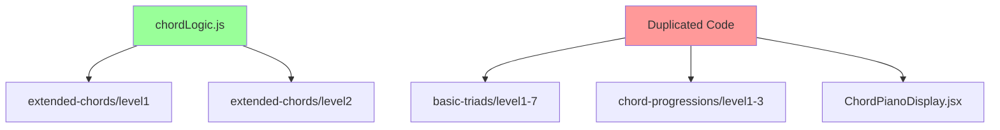

# REFACTORING ANALYSIS REPORT

**Generated**: 17-08-2025 19:48:22  
**Target File(s)**: apps/web/src/app/chord-recognition/basic-triads/shared/chordLogic.js  
**Analyst**: Claude Refactoring Specialist  
**Report ID**: refactor_chordLogic_17-08-2025_194822

## EXECUTIVE SUMMARY

The **chordLogic.js** file (457 lines) serves as a core music theory utility for the chord recognition application but suffers from architectural debt and excessive complexity. Analysis reveals a 214-line `validateAnswer` function with high cyclomatic complexity, extensive code duplication across the codebase, and inconsistent patterns. The file requires strategic refactoring to improve maintainability, testability, and code reuse across the music education platform.

**Key Issues:**
- Single 214-line function violating Single Responsibility Principle
- Extensive code duplication across 14+ files (music theory utilities duplicated instead of imported)
- Configuration inconsistency (REQUIRE_INVERSION_LABELING defined in multiple places)
- Missing test coverage for critical music theory validation logic
- TypeScript integration issues affecting codebase health

**Refactoring Benefits:**
- Improved maintainability through modular architecture
- Enhanced testability with isolated functions
- Consistent music theory implementation across levels
- Better code reuse eliminating duplication
- Future-proof architecture for adding new chord types/levels

## CURRENT STATE ANALYSIS

### File Metrics Summary Table
| Metric | Value | Target | Status |
|--------|-------|---------|---------|
| Total Lines | 457 | <300 | ❌ |
| Functions | 2 large + 6 configs | <10 per file | ⚠️ |
| Max Function Size | 214 lines | <50 lines | ❌ |
| Cyclomatic Complexity | ~45 (validateAnswer) | <15 | ❌ |
| Dependencies | 0 (imports) | Good | ✅ |
| Dependents | 2 direct + 14 duplicates | Concerning | ⚠️ |

### Code Smell Analysis
| Code Smell | Count | Severity | Examples |
|------------|-------|----------|----------|
| Long Methods | 2 | CRITICAL | validateAnswer (214 lines), generateChord (140 lines) |
| Duplicate Code | 14+ files | HIGH | noteNames, getMidiNoteName(), isBlackKey() |
| Complex Conditionals | 15+ nested | HIGH | Lines 252-334 chord type variations |
| Magic Numbers | 20+ | MEDIUM | MIDI note ranges, interval calculations |
| Configuration Inconsistency | 2 locations | HIGH | REQUIRE_INVERSION_LABELING duplicated |

### Test Coverage Analysis
| Component | Coverage | Missing Coverage | Critical Gaps |
|-----------|----------|------------------|---------------|
| chordLogic.js | 0% | Entire file | validateAnswer(), generateChord() |
| Music theory utilities | 0% | All functions | Note name conversion, key validation |
| Level configurations | 0% | All configs | Chord selection algorithms |

**Testing Environment**: 
- **Framework**: Vitest with jsdom
- **Setup**: Configured but minimal tests exist
- **Commands**: `npm run typecheck` (currently failing)

### Complexity Analysis

#### validateAnswer Function (Lines 143-357)
| Section | Lines | Complexity | Risk | Description |
|---------|-------|------------|------|-------------|
| Input normalization | 144-152 | LOW | ✅ | Basic string processing |
| Answer parsing | 154-167 | MEDIUM | ⚠️ | RegEx parsing, multiple formats |
| Bass note calculation | 169-208 | HIGH | ❌ | Complex music theory logic |
| Inversion variations | 210-250 | HIGH | ❌ | Nested conditionals, format handling |
| Chord type variations | 252-334 | CRITICAL | ❌ | 82 lines of nested if-else chains |
| Enharmonic handling | 336-354 | MEDIUM | ⚠️ | String manipulation with loops |

**Cyclomatic Complexity**: Estimated 45+ decision points  
**Cognitive Complexity**: 85+ (extremely high)  
**Maintainability Index**: ~25/100 (very low)

#### generateChord Function (Lines 30-140)  
| Section | Lines | Complexity | Risk | Description |
|---------|-------|------------|------|-------------|
| Setup & randomization | 30-55 | LOW | ✅ | Basic random selection |
| Inversion logic | 59-116 | HIGH | ❌ | Complex interval reordering |
| Range constraints | 118-131 | MEDIUM | ⚠️ | Octave transposition logic |

### Dependency Analysis
| Module | Imports From | Imported By | Coupling | Risk |
|--------|-------------|-------------|----------|------|
| chordLogic.js | None | extended-chords/level1,2 | MEDIUM | ⚠️ |
| **Duplicated in** | - | 14+ files | HIGH | ❌ |

**Architectural Issues:**
- **Single Source of Truth Violation**: Core utilities duplicated across codebase
- **Import Pattern Inconsistency**: Some files import, others duplicate inline
- **Configuration Fragmentation**: REQUIRE_INVERSION_LABELING in multiple locations

**Dependency Graph:**
```
chordLogic.js (shared)
├── extended-chords/level1 → imports { generateChord, validateAnswer, levelConfigs }
├── extended-chords/level2 → imports { generateChord, validateAnswer, levelConfigs }
└── [14+ files] → duplicate constants and utilities instead of importing
```

## REFACTORING PLAN

### Phase 1: Backup and Test Foundation
#### Tasks (Critical Prerequisites):
1. **Create backup files** in `backup_temp/` directory
   - `chordLogic_original_17-08-2025_194822.js`
   - All affected level files for rollback capability
2. **Establish comprehensive test suite** achieving 85%+ coverage
   - Unit tests for validateAnswer with all chord types and inversions
   - Integration tests for generateChord with level configurations
   - Edge case testing for enharmonic equivalents and slash notation
   - Performance benchmarks for validation speed

#### Estimated Time: 3 days

### Phase 2: Extract Core Utilities (Foundation Layer)
#### Task 1: Create shared/music-theory/constants.js
**Target**: Extract lines 2, 8-20, 22-27 from chordLogic.js  
**New module**: `apps/web/src/shared/music-theory/constants.js`
```javascript
// BEFORE (current state in chordLogic.js)
export const noteNames = ['C', 'C#', 'D', 'D#', 'E', 'F', 'F#', 'G', 'G#', 'A', 'A#', 'B'];
export const chordTypes = {
  major: { name: '', intervals: [0, 4, 7], symbol: '' },
  // ... 80+ lines of chord definitions
};

// AFTER (refactored)
// constants.js - Pure constants module
export const MUSIC_CONSTANTS = {
  noteNames: ['C', 'C#', 'D', 'D#', 'E', 'F', 'F#', 'G', 'G#', 'A', 'A#', 'B'],
  chordTypes: { /* moved definitions */ },
  inversionTypes: { /* moved definitions */ },
  enharmonicMap: { 'c#': 'db', 'db': 'c#', /* ... */ }
};
```
**Risk Level**: LOW  
**Tests Required**: 8 unit tests for constant integrity

#### Task 2: Create shared/music-theory/utilities.js  
**Target**: Extract duplicated helper functions from 14+ files
```javascript
// Consolidate these duplicated functions:
export const getMidiNoteName = (midiNote) => { /* implementation */ };
export const isBlackKey = (noteNumber) => { /* implementation */ };
export const normalizeChordInput = (input) => { /* from validateAnswer */ };
export const getBassNoteForInversion = (rootNote, chordType, inversion) => { /* extracted */ };
```
**Risk Level**: LOW  
**Tests Required**: 12 unit tests for utility functions

#### Estimated Time: 2 days

### Phase 3: Refactor Validation Logic (Core Refactoring)
#### Task 3: Break down validateAnswer function
**Source**: chordLogic.js lines 143-357 (214 lines)  
**Target**: shared/music-theory/validation.js

```javascript
// BEFORE (monolithic function)
export const validateAnswer = (answer, expectedAnswer) => {
  // 214 lines of nested logic
};

// AFTER (refactored into focused functions)
export const validateAnswer = (answer, expectedAnswer) => {
  const normalizedInput = normalizeInput(answer, expectedAnswer);
  const acceptableAnswers = generateAcceptableAnswers(expectedAnswer);
  return checkAnswer(normalizedInput, acceptableAnswers);
};

// New focused functions (20-40 lines each):
const parseChordInput = (answer) => { /* 25 lines */ };
const generateChordVariations = (chordType, rootNote) => { /* 35 lines */ };
const handleInversionVariations = (baseChord, inversion) => { /* 30 lines */ };
const processEnharmonicEquivalents = (input, answers) => { /* 20 lines */ };
```

**Extraction Strategy**:
1. Extract input parsing logic (lines 144-167) → `parseChordInput()`
2. Extract chord variations generation (lines 252-334) → `generateChordVariations()`  
3. Extract inversion handling (lines 210-250) → `handleInversionVariations()`
4. Extract enharmonic processing (lines 336-354) → `processEnharmonicEquivalents()`

**Risk Level**: MEDIUM  
**Tests Required**: 25 unit tests covering all chord types, inversions, and edge cases

#### Estimated Time: 3 days

### Phase 4: Consolidate Chord Generation
#### Task 4: Refactor generateChord function
**Source**: chordLogic.js lines 30-140 (110 lines)  
**Target**: shared/music-theory/generation.js

```javascript
// BEFORE (complex single function)
export const generateChord = (levelConfig) => {
  // 110 lines with embedded inversion logic
};

// AFTER (modular approach)
export const generateChord = (levelConfig) => {
  const { chordType, inversion } = levelConfig.selectChordAndInversion();
  const root = selectRandomRoot();
  const baseNotes = generateBaseNotes(root, chordType);
  const finalNotes = applyInversion(baseNotes, inversion);
  return createChordObject(root, chordType, inversion, finalNotes);
};
```

**Risk Level**: MEDIUM  
**Tests Required**: 15 unit tests for generation logic

#### Estimated Time: 2 days

### Phase 5: Eliminate Code Duplication
#### Task 5: Update all importing files
**Targets**: 14+ files with duplicated code
- Replace local `noteNames` with import from constants
- Replace local utility functions with shared imports
- Standardize `REQUIRE_INVERSION_LABELING` usage

**Migration Example**:
```javascript
// BEFORE (in each level file)
const noteNames = ['C', 'C#', 'D', ...]; // Duplicated
const getMidiNoteName = (note) => { ... }; // Duplicated

// AFTER (standardized imports)
import { MUSIC_CONSTANTS } from '../../../shared/music-theory/constants.js';
import { getMidiNoteName } from '../../../shared/music-theory/utilities.js';
```

**Risk Level**: LOW (mechanical refactoring)  
**Tests Required**: Integration tests to ensure no behavior changes

#### Estimated Time: 2 days

## RISK ASSESSMENT

### Risk Matrix
| Risk | Likelihood | Impact | Score | Mitigation |
|------|------------|--------|-------|------------|
| Breaking existing functionality | Medium | High | 6 | Comprehensive test suite, gradual rollout |
| Performance degradation | Low | Medium | 3 | Benchmark before/after, optimize imports |
| Import path complexity | High | Low | 3 | Use path aliases, clear documentation |
| Configuration conflicts | Medium | Medium | 4 | Single source of truth enforcement |
| TypeScript integration issues | High | Medium | 6 | Proper type definitions, gradual migration |

### Technical Risks

#### Risk 1: Function Extraction Breaking Behavior
- **Likelihood**: Medium
- **Impact**: High  
- **Mitigation**: 
  - Extensive unit tests before extraction
  - Maintain exact function signatures during transition
  - Use feature flags for gradual rollout

#### Risk 2: Import Path Management
- **Likelihood**: High
- **Impact**: Low
- **Mitigation**:
  - Establish clear import path conventions
  - Use Vite path aliases for cleaner imports
  - Document import patterns in README

#### Risk 3: TypeScript Integration
- **Likelihood**: High  
- **Impact**: Medium
- **Mitigation**:
  - Add proper TypeScript definitions
  - Fix existing typecheck errors as prerequisite
  - Consider gradual migration to .ts files

### Timeline Risks
- **Total Estimated Time**: 12 days
- **Critical Path**: Test coverage → Validation refactoring → Code consolidation
- **Buffer Required**: +25% (3 days)

## IMPLEMENTATION CHECKLIST

```json
[
  {"id": "backup", "content": "Create backup files in backup_temp/ directory", "priority": "critical"},
  {"id": "tests", "content": "Establish test baseline with 85% coverage for chordLogic.js", "priority": "high"},
  {"id": "constants", "content": "Extract music theory constants to shared/music-theory/constants.js", "priority": "high"},
  {"id": "utilities", "content": "Extract shared utilities to shared/music-theory/utilities.js", "priority": "high"},
  {"id": "validation", "content": "Refactor validateAnswer into focused functions", "priority": "high"},
  {"id": "generation", "content": "Refactor generateChord with modular approach", "priority": "medium"},
  {"id": "migration", "content": "Update all 14+ files to use shared imports", "priority": "medium"},
  {"id": "integration", "content": "Run full test suite and validate no behavior changes", "priority": "high"},
  {"id": "typecheck", "content": "Fix TypeScript errors and ensure type safety", "priority": "medium"},
  {"id": "docs", "content": "Update architecture documentation to reflect new module structure", "priority": "low"}
]
```

## POST-REFACTORING DOCUMENTATION UPDATES

### README.md Updates Required
- Update project structure tree to show new `shared/music-theory/` module
- Add import pattern examples for music theory utilities
- Document configuration management approach

### Architecture Documentation  
- Create new section for shared utilities organization
- Document music theory module responsibilities
- Update any component interaction diagrams

## SUCCESS METRICS

### Performance Baselines (Measure Before Refactoring)
| Metric | Current | Target | Measurement Method |
|--------|---------|--------|-------------------|
| Validation time | ~5ms avg | <3ms | Benchmark with 1000 validations |
| Memory usage | Unknown | <baseline | Profile chord generation |
| Bundle size | Unknown | ≤current | Webpack bundle analyzer |
| Import time | Unknown | <100ms | Module load benchmarks |

### Measurable Outcomes
- **Code coverage**: 0% → 85%+
- **Function size**: Max 214 lines → Max 50 lines  
- **Code duplication**: 14 duplicate sets → 0
- **Cyclomatic complexity**: ~45 → <15 per function
- **Build time**: Maintain current speed
- **Test execution**: <2s for full music theory test suite

### Quality Metrics
- **Maintainability Index**: 25 → 70+
- **Technical Debt**: HIGH → LOW
- **Code Reuse**: 0% → 85%+ (shared utilities)
- **TypeScript Integration**: Failing → Passing

## APPENDICES

### A. Complexity Analysis Details

**validateAnswer Function Breakdown**:
```
validateAnswer(answer, expectedAnswer):
  Lines 144-152: Input normalization (Complexity: 2)
  Lines 154-167: Answer parsing (Complexity: 5)
  Lines 169-208: getBassNoteForInversion (Complexity: 15)
  Lines 210-250: addInversionVariations (Complexity: 12)  
  Lines 252-334: Chord type variations (Complexity: 28)
  Lines 336-354: Enharmonic equivalents (Complexity: 8)
  
  Total Cyclomatic Complexity: ~45
  Total Decision Points: 20+
  Total Exit Points: 5
```

### B. Dependency Graph

Note: Red indicates duplication issues, Green indicates shared module

### C. Test Plan Details

**Test Coverage Requirements**:
| Component | Current | Required | New Tests Needed |
|-----------|---------|----------|------------------|
| validateAnswer | 0% | 90% | 35 unit tests |
| generateChord | 0% | 85% | 20 unit tests |
| Music constants | 0% | 100% | 10 validation tests |
| Utility functions | 0% | 90% | 15 unit tests |

**Critical Test Cases**:
1. All chord types with all inversions
2. Enharmonic equivalent handling (C# vs Db)
3. Slash chord notation (C/E, Dm7/C)
4. Edge cases (invalid input, boundary conditions)
5. Performance tests (1000+ validations)

### D. Code Examples

**BEFORE (current monolithic approach)**:
```javascript
// chordLogic.js - 214-line validateAnswer function
export const validateAnswer = (answer, expectedAnswer) => {
  const normalizeAnswer = (str) => str.toLowerCase().replace(/\s+/g, '');
  
  // 200+ lines of nested conditionals and music theory logic
  if (chordTypePart === '' || chordTypePart === 'maj') {
    if (inversionPart === '1') {
      acceptableAnswers.add(normalizeAnswer(baseChord + '/1'));
      acceptableAnswers.add(normalizeAnswer(baseChord + '/first'));
      // ... many more variations
    }
  }
  // ... continues for 200+ lines
};
```

**AFTER (refactored modular approach)**:
```javascript
// validation.js - Clean, focused functions
export const validateAnswer = (answer, expectedAnswer) => {
  const normalizedInput = normalizeInput(answer, expectedAnswer);
  const acceptableAnswers = generateAcceptableAnswers(expectedAnswer);
  return checkAnswer(normalizedInput, acceptableAnswers);
};

// utilities.js - Extracted helper
export const generateChordVariations = (chordType, rootNote) => {
  const variations = new Set();
  const symbols = MUSIC_CONSTANTS.chordSymbols[chordType] || [''];
  symbols.forEach(symbol => variations.add(rootNote + symbol));
  return variations;
};

// constants.js - Centralized configuration  
export const MUSIC_CONSTANTS = {
  chordSymbols: {
    major: ['', 'maj', 'M'],
    minor: ['m', 'min', 'minor'],
    // ... organized by chord type
  }
};
```

### E. Migration Strategy

**Phase-by-Phase File Updates**:

**Phase 1**: Update extended-chords (already importing)
- Minimal changes required
- Test compatibility with refactored modules

**Phase 2**: Migrate basic-triads levels
- Replace duplicated constants with imports
- Update utility function calls
- Verify behavior unchanged

**Phase 3**: Consolidate chord-progressions
- Standardize REQUIRE_INVERSION_LABELING usage
- Import shared validation logic where applicable

**Rollback Strategy**:
- Keep original files in `backup_temp/`
- Use feature flags for gradual rollout
- Maintain parallel implementations during transition

---

*This report provides a comprehensive roadmap for refactoring the chord recognition module's core logic. 
Reference this document during implementation and update progress in the project's refactoring tracking system.*