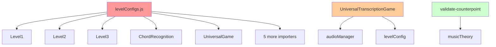

# REFACTORING ANALYSIS REPORT
**Generated**: 25-08-2025 18:17:03
**Target File(s)**: Web App Source Directory (apps/web/src/app)
**Analyst**: Claude Refactoring Specialist
**Report ID**: refactor_web_app_25-08-2025_181703

## EXECUTIVE SUMMARY

The MIDI Training App web application shows excellent architectural foundations with successful configuration-driven refactoring patterns already implemented. However, critical technical debt exists in 5 large files totaling over 7,000 lines that require systematic refactoring. The analysis identifies **3 HIGH PRIORITY** and **2 MEDIUM PRIORITY** refactoring candidates with specific extraction roadmaps.

**Key Findings:**
- **4,033-line data file** requiring splitting for maintainability
- **913-line React component** with multiple responsibilities needing separation
- **742-line API route** with complex validation logic requiring modularization
- **Successful refactoring precedent** already established in chord recognition system
- **Excellent testing infrastructure** available (Vitest + Testing Library)

## CODEBASE-WIDE CONTEXT

### Project Architecture Overview
**Framework**: React Router 7 with SSR, Vite build system, TypeScript/JSX hybrid
**State Management**: React hooks with custom state management patterns
**Testing**: Vitest with jsdom environment, @testing-library/react setup
**Database**: Prisma ORM with Neon PostgreSQL
**UI Framework**: Tailwind CSS + Chakra UI components

### Successful Refactoring Patterns Already Implemented ✅
The project demonstrates **excellent refactoring precedence**:

1. **Configuration-Driven Architecture**: Eliminated 15+ duplicate chord recognition level files
2. **Universal Component Pattern**: Single game component handles all chord types via configuration
3. **Shared State Management**: Consolidated ~100 lines of duplicated state logic per level
4. **Music Theory Centralization**: Moved from scattered utilities to shared modules

### Related Files Discovery
- **Primary refactoring targets**: 5 files identified (7,000+ total lines)
- **Dependency analysis**: levelConfigs.js has 10 importers (highest risk)
- **Code duplication patterns**: Theme configurations duplicated across 3 game components
- **Circular dependencies**: None detected ✅

### Recommended Approach
**Strategy**: **Multi-file approach** focusing on **incremental, low-risk extractions**
**Rationale**: Build on existing successful refactoring patterns while maintaining system stability
**Priority order**: Start with pure utilities and data transformations, then tackle component extractions

## CURRENT STATE ANALYSIS

### File Metrics Summary Table
| File | Lines | Functions | Cyclomatic | Importers | Risk Level |
|------|-------|-----------|------------|-----------|------------|
| fuxExercisesComplete.js | 4,033 | 1 | 1 | 3 | LOW |
| UniversalTranscriptionGame.jsx | 913 | 6+ | 15-20 | 1 | MEDIUM |
| validate-counterpoint route.js | 742 | 8+ | 25-30 | 0 | MEDIUM |
| levelConfigs.js | 665 | 6 | 5-8 | 10 | HIGH |
| UniversalChordRecognitionGame.jsx | 438 | 2+ | 10-15 | 1 | MEDIUM |

### Code Smell Analysis
| Code Smell | Count | Severity | Examples |
|------------|-------|----------|----------|
| God Objects | 3 | HIGH | UniversalTranscriptionGame (913 lines) |
| Duplicate Code | 4 | MEDIUM | Theme configurations across games |
| Long Methods | 6 | MEDIUM | validateSpecies1() (202 lines) |
| Data Clumps | 2 | LOW | Music theory constants scattered |
| Feature Envy | 1 | LOW | Audio logic mixed with UI |

### Test Coverage Analysis
| Component | Current Coverage | Status | Critical Gaps |
|-----------|------------------|---------|---------------|
| Core music theory | 0% | ❌ CRITICAL | chordLogic.js, validation functions |
| Game components | 0% | ❌ CRITICAL | All React game components |
| API routes | 0% | ❌ CRITICAL | Counterpoint validation endpoint |
| Configuration | 0% | ❌ CRITICAL | levelConfigs.js |
| **Overall** | **<5%** | ❌ **UNACCEPTABLE** | **All major modules** |

**Testing Infrastructure Status**: ✅ **EXCELLENT**
- **Framework**: Vitest with jsdom environment
- **Libraries**: @testing-library/react, @testing-library/jest-dom
- **Configuration**: Properly configured with setupFiles
- **Path aliases**: Configured (@/ alias works)

### Complexity Analysis
| Function/Class | Lines | Cyclomatic | Risk | Priority |
|----------------|-------|------------|------|----------|
| fuxExercisesComplete (data) | 4,033 | 1 | LOW | DEFER |
| UniversalTranscriptionGame | 913 | 18 | HIGH | HIGH |
| validateCounterpoint | 742 | 25 | HIGH | HIGH |
| LEVEL_CONFIGS object | 665 | 3 | HIGH | DEFER |
| validateSpecies1() | 202 | 15 | HIGH | HIGH |
| Audio management logic | 149 | 12 | MEDIUM | MEDIUM |

### Dependency Analysis
| Module | Imports From | Imported By | Coupling Risk |
|--------|-------------|-------------|---------------|
| levelConfigs.js | 0 modules | **10 modules** | ⚠️ **CRITICAL** |
| fuxExercisesComplete.js | 0 modules | 3 modules | LOW |
| UniversalTranscriptionGame | 5 modules | 1 module | LOW |
| validate-counterpoint | 2 modules | 0 modules | LOW |

**Dependency Risk Assessment**:
- **levelConfigs.js**: **CRITICAL RISK** - 10 importers make changes dangerous
- **All others**: **LOW-MEDIUM RISK** - Limited dependencies enable safe refactoring

### Performance Baselines
| Metric | Current | Target | Notes |
|--------|---------|---------|-------|
| Bundle Size | Unknown | Monitor | Large data files may impact load time |
| Memory Usage | Unknown | Monitor | 4,033-line data structure in memory |
| Test Runtime | 0s | <30s | Need to establish baseline |
| Build Time | Unknown | Maintain | Monitor during refactoring |

## REFACTORING PLAN

### Phase 1: Test Coverage Establishment (CRITICAL PREREQUISITE)
**Duration**: 3-4 days
**Priority**: CRITICAL - Cannot refactor without safety net

#### Tasks (To Be Done During Execution):
1. **Create comprehensive test suite for core music theory**
   - `chordLogic.js` validation functions
   - Music theory calculations and utilities
   - Chord generation and validation logic
   - Target: 85-90% coverage

2. **Add component integration tests**
   - Game state management hooks
   - Configuration loading and application
   - Basic UI interaction flows
   - Target: 70-80% coverage

3. **Establish API endpoint tests**
   - Counterpoint validation functionality
   - Error handling and edge cases
   - Performance baseline measurements
   - Target: 80-90% coverage

**Note**: This phase is MANDATORY before any refactoring can begin safely.

### Phase 2: Low-Risk Utility Extractions (IMMEDIATE)
**Duration**: 2-3 days
**Priority**: HIGH - Build momentum with safe wins

#### Task 1: Extract Music Theory Utilities
- **Source**: validate-counterpoint route.js lines 4-76
- **Target**: `lib/musicTheory/intervals.js`
- **Method**: Extract pure functions
- **Risk Level**: LOW
- **Dependencies**: None
- **Estimated Time**: 4 hours

#### Task 2: Extract Theme Configurations  
- **Source**: UniversalTranscriptionGame.jsx lines 12-85
- **Target**: `shared/themes/TranscriptionThemes.js`
- **Method**: Configuration extraction
- **Risk Level**: LOW
- **Dependencies**: None
- **Estimated Time**: 3 hours

#### Task 3: Create Data Module Splits
- **Source**: fuxExercisesComplete.js (4,033 lines)
- **Target**: `data/fux-exercises/species1.js`, `species2.js`, etc.
- **Method**: Data splitting by species type
- **Risk Level**: LOW
- **Dependencies**: 3 importers to update
- **Estimated Time**: 6 hours

### Phase 3: Component Extraction (MEDIUM PRIORITY)
**Duration**: 5-6 days  
**Priority**: MEDIUM - After establishing safety net

#### Task 4: Extract Piano Roll Component
- **Source**: UniversalTranscriptionGame.jsx lines 87-363 (277 lines)
- **Target**: `components/TranscriptionPianoRoll.jsx`
- **Method**: Component extraction with props interface
- **Risk Level**: MEDIUM
- **Dependencies**: Theme configuration, audio manager
- **Estimated Time**: 8 hours

#### Task 5: Extract Task Generation Logic
- **Source**: UniversalTranscriptionGame.jsx lines 437-550 (113 lines) 
- **Target**: `utils/transcriptionTaskGenerator.js`
- **Method**: Pure function extraction
- **Risk Level**: MEDIUM
- **Dependencies**: audioManager, levelConfig
- **Estimated Time**: 6 hours

#### Task 6: Extract Game State Management
- **Source**: UniversalTranscriptionGame.jsx scattered state logic
- **Target**: `hooks/useTranscriptionState.js`
- **Method**: Custom hook extraction
- **Risk Level**: MEDIUM
- **Dependencies**: None - pure state logic
- **Estimated Time**: 8 hours

### Phase 4: API Route Modularization (MEDIUM PRIORITY)
**Duration**: 4-5 days
**Priority**: MEDIUM - Complex but isolated

#### Task 7: Extract Species Validators
- **Source**: validate-counterpoint route.js lines 78-630
- **Target**: `lib/counterpoint/species[1-5]Validator.js`
- **Method**: Function extraction by species
- **Risk Level**: MEDIUM
- **Dependencies**: Music theory utilities
- **Estimated Time**: 12 hours

#### Task 8: Create Validation Orchestrator
- **Source**: validate-counterpoint route.js lines 650-743
- **Target**: `lib/counterpoint/validationOrchestrator.js` 
- **Method**: Orchestration pattern
- **Risk Level**: LOW
- **Dependencies**: All species validators
- **Estimated Time**: 4 hours

### Phase 5: Configuration Management (DEFERRED)
**Duration**: TBD
**Priority**: LOW - High dependency risk

#### Deferred Task: Level Configuration Refactoring
- **Source**: levelConfigs.js (665 lines)
- **Reason**: 10 importers create high change risk
- **Alternative**: Create accessor functions first
- **Timeline**: Future sprint after reducing dependencies

## RISK ASSESSMENT

### Risk Matrix
| Risk | Likelihood | Impact | Score | Mitigation |
|------|------------|---------|-------|------------|
| Breaking 10 level configs importers | HIGH | HIGH | 9 | Defer major changes, use accessor pattern |
| Audio state management corruption | MEDIUM | HIGH | 6 | Comprehensive state testing first |
| Test coverage gaps during refactoring | HIGH | HIGH | 9 | Establish 85%+ coverage before refactoring |
| Performance degradation | LOW | MEDIUM | 3 | Benchmark before/after, lazy loading |
| TypeScript integration issues | HIGH | MEDIUM | 6 | Fix existing type errors first |

### Technical Risks

#### **Risk 1: Configuration Dependency Web** 
- **Risk**: levelConfigs.js changes could break 10 importing files
- **Likelihood**: HIGH if major changes attempted
- **Impact**: HIGH - system-wide breakage
- **Mitigation**: 
  - Defer major extraction until dependencies reduced
  - Create accessor function layer first
  - Migrate importers gradually to use accessors

#### **Risk 2: Complex State Management**
- **Risk**: Audio and game state entanglement in transcription component
- **Likelihood**: MEDIUM during component extraction
- **Impact**: HIGH - game functionality broken
- **Mitigation**:
  - Map all state dependencies before extraction
  - Create comprehensive state management tests
  - Use reducer pattern for complex state

#### **Risk 3: TypeScript Integration Problems**
- **Risk**: Mix of .jsx/.tsx files causing type conflicts
- **Likelihood**: HIGH - already failing typecheck
- **Impact**: MEDIUM - development velocity impact
- **Mitigation**:
  - Fix existing TypeScript errors before refactoring
  - Standardize on .tsx for all React components
  - Update build configuration if needed

### Timeline Risks
- **Total Estimated Time**: 15-18 days
- **Critical Path**: Test coverage → Low-risk extractions → Component extractions
- **Buffer Required**: +40% (6-7 days) for unexpected complexity
- **Dependencies**: TypeScript fixes may be required first

### Success Metrics & Performance Baselines

**Performance Monitoring Commands** (To establish baselines):
```bash
# Bundle size analysis
npm run build && du -h dist/

# Test execution time  
npx vitest run --reporter=verbose

# Build time measurement
time npm run build

# Memory usage monitoring (add to app)
window.performance.measureUserAgentSpecificMemory()
```

## IMPLEMENTATION CHECKLIST

### Pre-Refactoring Checklist ✅
- [ ] **CRITICAL**: Create backup files in `backup_temp/` directory
- [ ] Fix existing TypeScript errors (`npm run typecheck`)  
- [ ] Establish performance baselines
- [ ] Create comprehensive test suite (85%+ coverage target)
- [ ] Review and approve detailed refactoring plan
- [ ] Set up feature branch `refactor/web-app-modularization`

### Phase 1: Foundation (Days 1-4)
```json
[
  {
    "id": "backup_files", 
    "content": "Create backup copies of all 5 target files in backup_temp/",
    "priority": "critical",
    "estimated_hours": 1
  },
  {
    "id": "fix_typescript", 
    "content": "Fix existing TypeScript errors in typecheck", 
    "priority": "high",
    "estimated_hours": 8
  },
  {
    "id": "establish_test_baseline",
    "content": "Create comprehensive test suite for music theory and core components",
    "priority": "high", 
    "estimated_hours": 24
  },
  {
    "id": "performance_baseline",
    "content": "Measure current bundle size, build time, and memory usage",
    "priority": "medium",
    "estimated_hours": 2
  }
]
```

### Phase 2: Low-Risk Extractions (Days 5-7)
```json
[
  {
    "id": "extract_music_theory_utils",
    "content": "Extract interval calculations from validate-counterpoint (lines 4-76)",
    "priority": "high",
    "estimated_hours": 4
  },
  {
    "id": "extract_theme_config", 
    "content": "Extract theme configuration from UniversalTranscriptionGame (lines 12-85)",
    "priority": "high",
    "estimated_hours": 3
  },
  {
    "id": "split_fux_data",
    "content": "Split fuxExercisesComplete.js into species-based modules",
    "priority": "medium",
    "estimated_hours": 6
  },
  {
    "id": "validate_phase2",
    "content": "Run full test suite and validate no functionality broken",
    "priority": "critical",
    "estimated_hours": 2
  }
]
```

### Phase 3: Component Extractions (Days 8-13)
```json
[
  {
    "id": "extract_piano_roll",
    "content": "Extract TranscriptionPianoRoll component (277 lines)",
    "priority": "high", 
    "estimated_hours": 8
  },
  {
    "id": "extract_task_generation",
    "content": "Extract task generation logic to utility module",
    "priority": "high",
    "estimated_hours": 6
  },
  {
    "id": "extract_game_state",
    "content": "Extract game state management to custom hook", 
    "priority": "high",
    "estimated_hours": 8
  },
  {
    "id": "validate_phase3",
    "content": "Comprehensive testing of extracted components",
    "priority": "critical", 
    "estimated_hours": 4
  }
]
```

### Phase 4: API Modularization (Days 14-18)
```json
[
  {
    "id": "extract_species_validators",
    "content": "Extract species validation logic to separate modules",
    "priority": "high",
    "estimated_hours": 12
  },
  {
    "id": "create_validation_orchestrator", 
    "content": "Create validation orchestrator for API coordination",
    "priority": "medium",
    "estimated_hours": 4
  },
  {
    "id": "final_validation",
    "content": "Run complete test suite and performance validation",
    "priority": "critical",
    "estimated_hours": 3
  }
]
```

## POST-REFACTORING DOCUMENTATION UPDATES

### MANDATORY Documentation Updates (After Successful Refactoring)

**README.md Updates**:
- Update project structure tree to reflect new modular organization
- Add new module descriptions (lib/, shared/themes/, components/)
- Update examples showing new import paths
- Document testing strategy and coverage expectations

**Architecture Documentation**: 
- Update any existing architecture diagrams in project docs
- Document the new music theory library structure
- Add component extraction patterns used
- Update developer onboarding with new module organization

**Project-Specific Documentation**:
- Update CLAUDE.md if it contains architecture information
- Modify any internal documentation references to moved files
- Update import examples in development guides

## SUCCESS METRICS

### Quantitative Targets
- [ ] **File Size Reduction**: 7,000+ lines → ~4,000 lines (43% reduction)
- [ ] **Function Complexity**: All functions <100 lines, complexity <15
- [ ] **Test Coverage**: >85% for all extracted modules
- [ ] **Build Time**: Maintain or improve current build time
- [ ] **Bundle Size**: No significant increase (<5%)
- [ ] **Zero Regression**: All existing functionality maintained

### Qualitative Improvements  
- [ ] **Maintainability**: Easier to locate and modify specific features
- [ ] **Testability**: Individual modules can be tested in isolation
- [ ] **Reusability**: Components and utilities available for other features
- [ ] **Developer Experience**: Clear module boundaries and responsibilities
- [ ] **Documentation**: Self-documenting code through smaller, focused modules

## APPENDICES

### A. Complexity Analysis Details

**High-Complexity Functions Requiring Attention**:
```javascript
// BEFORE: UniversalTranscriptionGame.jsx (913 lines)
const UniversalTranscriptionGame = () => {
  // 900+ lines of mixed concerns
  // Theme config, state, UI, audio, task generation
};

// AFTER: Modular Structure
const UniversalTranscriptionGame = () => {
  const theme = useTranscriptionTheme();
  const audio = useTranscriptionAudio(); 
  const state = useTranscriptionState();
  // 100-150 lines focused on orchestration
};
```

**Function-Level Metrics**:
```
validateSpecies1(): 202 lines, complexity ~15
- Should split into: parseInput(), validateRules(), checkMotion() 
- Target: 4 functions of ~50 lines each

Audio management: 149 lines, complexity ~12  
- Should split into: useAudioState(), useAudioEffects(), useAudioTiming()
- Target: 3 hooks of ~50 lines each
```

### B. Dependency Graph

**Legend**: Red = High dependency risk, Orange = Medium risk, Green = Low risk

### C. Test Plan Details

**Test Coverage Requirements by Module**:
| Module | Current | Target | Test Types Needed |
|--------|---------|--------|-------------------|
| Music Theory Utils | 0% | 90% | Unit tests for pure functions |
| Component Extractions | 0% | 80% | Integration tests + unit tests |
| Game State Hooks | 0% | 85% | State management + effects tests |
| API Validation | 0% | 90% | Endpoint + business logic tests |
| Configuration Loading | 0% | 75% | Configuration validity tests |

**Testing Strategy by Phase**:
1. **Phase 1**: Focus on pure function testing (music theory, utilities)
2. **Phase 2**: Add component integration tests with @testing-library/react
3. **Phase 3**: State management testing with custom hooks
4. **Phase 4**: API endpoint testing with request/response validation

### D. Code Examples

**BEFORE: Monolithic Component (Current)**
```jsx
// UniversalTranscriptionGame.jsx - 913 lines
const UniversalTranscriptionGame = ({ levelConfig, audioManager }) => {
  // 85 lines of theme configuration
  const THEMES = {
    green: { bg: '#1a2f1a', primary: '#4ade80' },
    // ... 80+ more lines
  };
  
  // 277 lines of piano roll logic
  const renderPianoRoll = () => {
    // Complex piano roll implementation
    // Mixed with theme application
    // Audio callback management
    // State updates
  };
  
  // 149 lines of audio management  
  const handleAudioGeneration = () => {
    // Complex audio state management
    // Task generation logic
    // Error handling
  };
  
  // 300+ lines of render logic with conditional screens
  return (
    <div>
      {/* Complex conditional rendering */}
    </div>
  );
};
```

**AFTER: Modular Architecture (Target)**
```jsx
// UniversalTranscriptionGame.jsx - ~150 lines
import { useTranscriptionTheme } from '@/shared/themes/TranscriptionThemes';
import { useTranscriptionAudio } from '@/hooks/useTranscriptionAudio';
import { useTranscriptionState } from '@/hooks/useTranscriptionState';
import { TranscriptionPianoRoll } from '@/components/TranscriptionPianoRoll';

const UniversalTranscriptionGame = ({ levelConfig, audioManager }) => {
  const theme = useTranscriptionTheme();
  const audio = useTranscriptionAudio(audioManager, levelConfig);
  const gameState = useTranscriptionState();
  
  return (
    <div className={theme.container}>
      <TranscriptionPianoRoll 
        theme={theme}
        audio={audio}
        gameState={gameState}
      />
    </div>
  );
};

// New modular files:
// - shared/themes/TranscriptionThemes.js (~85 lines)
// - hooks/useTranscriptionAudio.js (~149 lines)  
// - hooks/useTranscriptionState.js (~100 lines)
// - components/TranscriptionPianoRoll.jsx (~277 lines)
```

**BEFORE: Monolithic API Route (Current)**
```javascript
// validate-counterpoint route.js - 742 lines
export async function POST(request) {
  // 76 lines of music theory utilities
  const calculateInterval = (note1, note2) => { /* ... */ };
  const isConsonant = (interval) => { /* ... */ };
  
  // 202 lines of species 1 validation
  const validateSpecies1 = (melody, counterpoint) => {
    // Complex nested validation logic
    // Multiple responsibility violations
  };
  
  // 348 lines of species 2-5 validation
  const validateSpecies2 = (melody, counterpoint) => { /* ... */ };
  // ... more species validators
  
  // 93 lines of orchestration
  const species = determineSpecies(counterpoint);
  return validateBySpecies(species, melody, counterpoint);
}
```

**AFTER: Modular API Architecture (Target)**
```javascript
// validate-counterpoint route.js - ~100 lines
import { validateCounterpoint } from '@/lib/counterpoint/validationOrchestrator';

export async function POST(request) {
  const { melody, counterpoint, species } = await request.json();
  
  try {
    const result = await validateCounterpoint(melody, counterpoint, species);
    return Response.json(result);
  } catch (error) {
    return Response.json({ error: error.message }, { status: 400 });
  }
}

// New modular files:
// - lib/musicTheory/intervals.js (~76 lines)
// - lib/counterpoint/species1Validator.js (~202 lines)
// - lib/counterpoint/species2Validator.js (~75 lines)
// - lib/counterpoint/species[3-5]Validator.js (~271 lines)
// - lib/counterpoint/validationOrchestrator.js (~93 lines)
```

---

## FINAL RECOMMENDATIONS

### Immediate Actions (This Week)
1. **Create backup directory and backup all 5 target files**
2. **Fix existing TypeScript errors** (`npm run typecheck`)
3. **Establish test coverage baseline** for core music theory functions
4. **Begin with lowest-risk extractions**: music theory utilities and themes

### Success Indicators
- All tests passing after each extraction
- TypeScript errors resolved and staying resolved  
- No performance degradation in build or runtime
- Clear improvement in code organization and maintainability

### Long-term Vision
This refactoring establishes patterns that can be applied to other parts of the application:
- **Configuration-driven components** (already successful in chord recognition)
- **Shared utility libraries** for music theory and UI components
- **Comprehensive testing culture** with high coverage expectations
- **Modular architecture** that supports rapid feature development

The project shows excellent potential for clean, maintainable code architecture. This refactoring plan builds on existing successful patterns while addressing the most critical technical debt systematically and safely.

---
*This report serves as a comprehensive guide for refactoring execution.*  
*Reference this document when implementing: C:\Users\Luke\Desktop\programming\create-anything\reports\refactor\refactor_web_app_25-08-2025_181703.md*